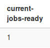

# Prerequisiti

- [AMP (Apache2, MySQL, PHP)](#installare-amp)
- [composer](https://getcomposer.org/doc/00-intro.md)
- [Beanstalkd](#installare-beanstalkd-1)
- [Supervisor](#supervisor-1)


## Installare AMP

Per installare laravel bisogna installare PHP, MySQL (o un RDBMS supportato da Laravel), un webserver che interpreti PHP.
Questi requisiti si possono installare tramite i software **\*AMP** rispettivamente:

- LAMP per Linux
- MAMP per Mac
- XAMPP/WAMP/EasyPHP o simili per Windows

### -  Linux

Se si ha una distro Debian-based si può installare LAMP tramite i seguenti comandi:
```
$ sudo apt install tasksel
$ sudo tasksel
```

Selezionare il meta-pacchetto "LAMP" (usando le freccette e "spazio") andare su "OK" tramite il pulsante TAB

### - Mac

È possibile scaricare MAMP da [qui](https://www.mamp.info/en/downloads/) oppure tramite hombrew seguendo [questa guida](https://gist.github.com/alanthing/4089298)

### - Windows

Download [EasyPHP](http://www.easyphp.org/download.php)

### Alternative (cross-platform)
- [XAMPP](https://www.apachefriends.org/download.html)
- [WAMP](http://www.wampserver.com/en/)

# Installare beanstalkd
## - Linux
```
$ sudo apt install beanstalkd
```

## - Mac
```
$ brew install beanstalkd
```

## Installare beanstalkd_console

Questo tool è un pannello di amministrazione per visualizzare le code di beanstalkd, [opensource](https://github.com/ptrofimov/beanstalk_console) scritto in PHP.

Esso si può installare tramite composer:

```
composer create-project ptrofimov/beanstalk_console -s dev
```
---
beanstalkd_console necessita phpmbstring. Qualora non l'aveste già potete installarlo su qualsiasi distribuzione debian-based come segue:

```
sudo apt-get install php-mbstring php7.0-mbstring php-gettext libapache2-mod-php7.0
```

---
---

Una volta installato si può aprire tramite browser visitando *beanstalkd_console/public/* e si può aggiungere un server (locale in questo caso) tramite "Add Server" con Host localhost e porta 11300 (di default).

---


---

# Supervisor

Per automatizzare l'esecuzione dei job di laravel, bisogna installare il servizio supervisor:

**Linux**
```
$ sudo apt install supervisor
```

**[Mac](https://gist.github.com/fadhlirahim/78fefdfdf4b96d9ea9b8)**
```
$ sudo pip install supervisor
```

Creiamo una cartella dove tenere i logs del servizio supervisord:
```
$ sudo touch /var/log/supervisor.log
```

Successivamente bisognare creare un file di conf *(queue.conf)* della nostra queue in **/etc/supervisor/conf.d/queue.conf**

```
[program:queue]
command=php artisan queue:listen --tries=2
directory=/var/www/html/webnetspot/backend
stdout_logfile=/var/log/supervisor.log
redirect_stderr=true
```

Avviare supervisord ed aggiungere il nuovo file di conf (queue.conf):
```
$ sudo supervisorctl reread
$ sudo supervisorctl add queue
```

Avviare il programma definito nel nostor queue.conf
```
$ sudo supervisorctl start queue
```

# Installare Laravel

[Creare un progetto Laravel da 0](http://shinworld.altervista.org/wordpress/installare-creare-primo-progetto-laravel-jwtauth/)

## Installare il progetto Laravel presente su webnetspot

```
$ cd backend
$ composer install
$ chmod 777 -R storage/
$ chmod 777 -R storage/logs/
$ chmod 777 -R storage/framework/cache
$ chmod 777 -R storage/framework/views
$ chmod 777 -R storage/framework/sessions
$ chmod 777 -R bootstrap/cache
```

Configurare le credenziali per la connessione al database, quindi, copiare il file .env.example,che si trova nella cartella backend rinominandolo in .env ed inserendo i parametri richiesti:

```
DB_CONNECTION=mysql
DB_HOST=127.0.0.1
DB_PORT=3306
DB_DATABASE=nome_database
DB_USERNAME=username
DB_PASSWORD=password
```

Assicurarsi che nel file .env il parametro APP_KEY non sia vuoto, altrimenti eseguire:
```
php artisan key:generate
```

Assicurarsi che nel file **.env** non ci sia *QUEUE_DRIVER=default*, in caso sostituirla con **QUEUE_DRIVER=beanstalkd**

Per testare se Laravel è stato installato correttamente andare su  http://localhost/yourPrj/public/index.php


---

## Configurare Laravel per Beanstalkd
Tramite il tool composer è possibile aggiungere pacchetti/dipendenze ad un progetto, in questo a noi torna utile il pacchetto pheanstalk, un  client beanstalkd scirtto in PHP che permette a Laravel di connettersi al servizio beanstalkd

```
$ composer require pda/pheanstalk
$ composer update
```

Una volta scaricato ed installato, impostare beanstalkd come queue driver di laravel tramite il file */config/queue.php* contenuto nella cartella backend.
 
```
'default' => 'beanstalkd',
```

Assicurarsi che nel file **.env** non ci sia QUEUE_DRIVER=default, in caso sostituirlo con **QUEUE_DRIVER=beanstalkd**


## [Creare un job su laravel](https://laravel.com/docs/5.4/queues#creating-jobs)

Se NON hai installato Laravel da 0 non hai bisogno di creare un Job, poichè il Job è già presente nella repository webnetspot.

[Commit dove sono svolte le seguenti indicazioni](https://github.com/IamTask/webNETSPOT/commit/ad5f0c503f0e887552b798b4b450e421fcd4be05)

Per prima cosa, per lavorare con le queue è necessario creare un "job" ovvero una classe che svolgerà una determinata "richiesta", un determinato "lavoro di esecuzione", un job.

Questa classe la si può creare su app/Jobs/ tramite artisan.php un tool all'interno di laravel, quindi eseguire da riga di comando con:

```
php artisan make:job SigSpot
```

*SigSpot* sarà il nome della classe, quindi del job, ed anche del file.

Questa classe di default avrà un metodo __construct(), che è appunto il costruttore della classe, ed il metodo handle(), metodo che verrà eseguito all'esecuzione del job.

Esempio di Job con attributo "$path":

```
<?php

namespace App\Jobs;

use Illuminate\Bus\Queueable;
use Illuminate\Queue\SerializesModels;
use Illuminate\Queue\InteractsWithQueue;
use Illuminate\Contracts\Queue\ShouldQueue;
use Illuminate\Foundation\Bus\Dispatchable;

class SigSpot implements ShouldQueue
{
    use Dispatchable, InteractsWithQueue, Queueable, SerializesModels;

		protected $path;

    /*
     * @return void
     */
    public function __construct($path)
    {
        $this->path = $path;
    }

    /**
     * Execute the job.
     *
     * @return void
     */
    public function handle()
    {
        exec("cd '/file/path/JavaProject_Netspot'; java -cp lib/GraphLib.jar:lib/meden.jar:lib/oplall.jar:lib/Refine.jar:. SigSpot wikipedia990.quadruples 10 10 output/" . $this->path . " > /dev/null 2>/dev/null &");
    }
}
```

Creato il job lo si può eseguire creando la classe SigSpot ed usando la funzione **dispatch()**:
```
$job = (new SigSpot("output.txt"))
            ->onConnection("beanstalkd");

dispatch($job);
```

Per fare un test è possibile creare una route che richiami il job, quindi creare un nuovo controller su *app/Http/Controllers/*:

SigSpotController.php
```
<?php
namespace App\Http\Controllers;

use App\Jobs\SigSpot;
use Illuminate\Http\Request;
use App\Http\Controllers\Controller;

class SigSpotController extends Controller
{

	public function add() {
		Queue::push('MyQueue', array());
	}

    /**
     * @param  Request  $request
     * @return Response
     */
    public function requestJob(Request $request)
    {

		$job = (new SigSpot("output.txt"))
		->onConnection('beanstalkd');

		dispatch($job);

    }
}
```

Aggiungere la route requestJob su **routes/web.php**:


```
Route::get('route_job', 'SigSpotController@requestJob');
```

Quindi visitare http://localhost/webnetspot/backend/public/index.php/route_job per testare la route.

Visitando la route "route_job", si richiede l'esecuzione del job, quindi nella beanstalk_console si vedrà incrementare la **current-jobs-ready**

---



È possibile eseguire il job tramite artisan:

```
php artisan queue:work
```
